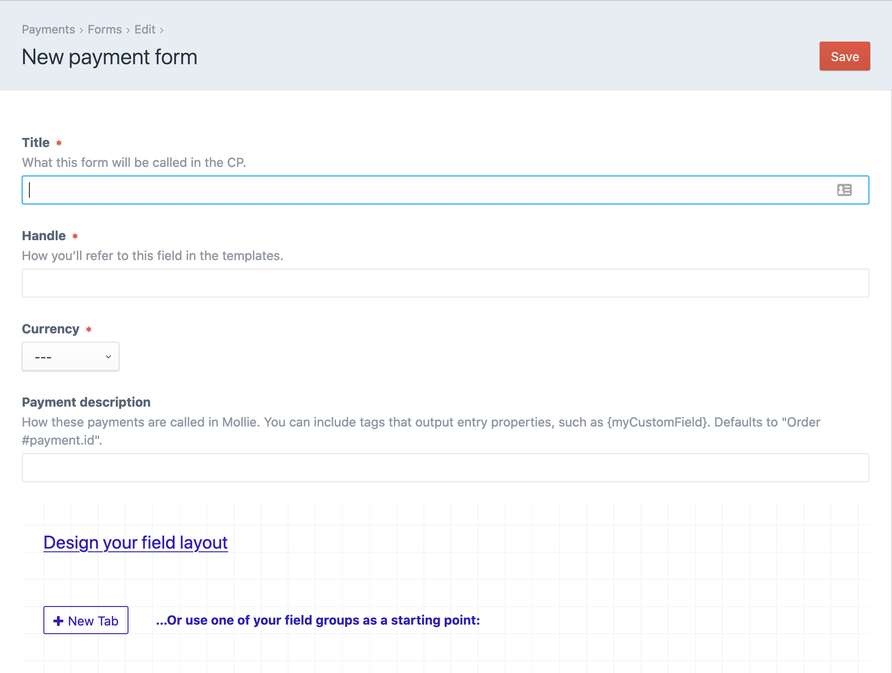

# General

## 0. Requirements

This plugin requires Craft CMS 3.1.0 or later, and a [Mollie](https://www.mollie.com) account.


## 1. Installation

To install the plugin, follow these instructions.

1. Open your terminal and go to your Craft project:

```bash
# go to the project directory
cd /path/to/my-craft-project.dev

# tell Composer to install the plugin
composer require studioespresso/craft-mollie-payments

# tell Craft to install the plugin
./craft install/plugin mollie-payments
```

## 2. Create a payment form

Payment forms are where you determine which currency the payment should be made in, and which fields are included on the payment element. 
These fields can be saved from the frontend form by using the name like so: ``<input type="text" name="fields[body]">``




## 3. Form template

```html
<form method="post">
    {{ csrfInput() }}
    {{ actionInput("mollie-payments/payment/pay") }}
    {{ redirectInput("confirmation-page") }}
    <input type="hidden" name="amount" value="{{ 20|hash }}">
    <input type="hidden" name="form" value="{{ 1|hash }}">
    
    <input type="email" name="email">
    <input type="text" name="fields[firstName]">
    <input type="text" name="fields[lastName]">
    <input type="submit" class="btn " value="Pay">
</form>
```

 