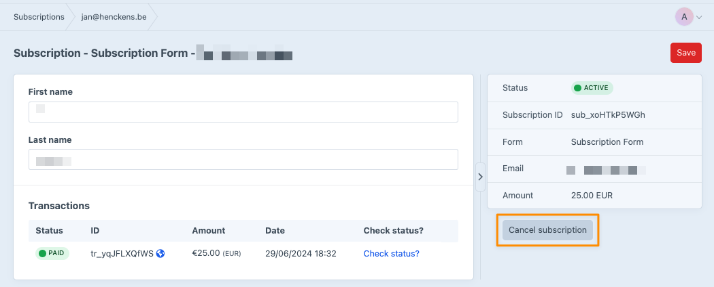

# Managing subscriptions

## Front-end
To allow users to manage their subscription(s), we need a way to authenticate them. 

### Craft User
If there is a Craft user signed in when the subscription is created, the plugin will save the user's ID with a subscriber automatically.

Fetching subscriptions by a logged-in user can be done using the following function, passing the currentUser as the argument

```twig

```


### By e-mail
On sites that don't user Craft's users, the only way to authenticate a subscriptions owner is through their email address.

That flow works as follows:
- We have a form in which the user supplies their emailaddress
- If we have a customer of the supplied address, we'll send out an email that contains a link on which the user can manage their subscription

To give you control over this experience (both how it looks and how it is worded), you can use the following settings:
<br>

#### Template path for "manage subscription" email  - `manageSubscriptionEmailPath`
Which template the plugin should use for this email. The link to manage the user's subscriptions is available in the ``link`` variable. You also have access to the full `subscription` element, with the custom fields you have set on it. 

#### Subject of the "manage subscription" email - `manageSubscriptionEmailSubject`
The subject for the email

#### Route/URL to the "manage your subscription - `manageSubscriptionRoute`
URL where the page to manage subscriptions is located.


#### Form
````twig
 <form method="post">
    {{ csrfInput() }}
    {{ actionInput('mollie-payments/subscription/get-link-for-customer') }}
    <div>
        <label for="email">{{ "E-mail"|t }}</label>
        <input type="email" required name="email">
    </div>
    <button type="submit">{{ "Find my subscription"|t }}</button 
</form>
````

#### Overview

````twig




    <div class="my-4">
        <form method="post">
            {{ actionInput('mollie-payments/subscription/cancel') }}
            {{ redirectInput('') }}
            {{ hiddenInput('subscription', subscription.id) }}
            {{ hiddenInput('subscriber', uid) }}
            
            {{ sub.interval }} - €{{ sub.amount }} - {{ sub.email }}<br>
            
            <button type="submit">{{ "Cancel subscription"|t }}</button>
        </form>
    </div>

````

## Control panel
Subscriptions can also be managed from the control panel. For active subscriptions, a button to cancel the subscrtiption will be displayed in the sidebar.



## Recovering stuck subscriptions <Badge type="info" text="5.4.5" />

If a subscription's first payment was paid but the subscription was never created in Mollie, it stays stuck: its status remains `pending` and no `subscriptionId` is stored. Because Mollie does not resend webhooks for old payments, these have to be recovered manually.

A subscription is considered stuck when **all** of the following are true:
- `subscriptionStatus` is `pending`
- it has no `subscriptionId`
- it has a linked transaction with status `paid`

The plugin ships a console command to recover these:

```sh
# List what would be recovered, without contacting Mollie to create anything
./craft mollie-payments/subscriptions/recover --dry-run

# Recover the stuck subscriptions
./craft mollie-payments/subscriptions/recover
```

Always run the `--dry-run` first — it is read-only and prints, per subscription, the date the first charge would be scheduled on (or whether it would be linked to an existing Mollie subscription).

#### First charge date
The first charge is anchored to the original billing cadence: it's set to the first occurrence of `paidAt + N × interval` that falls today or later. This keeps the customer's billing day consistent and never charges for an already-paid period.

> [!Warning]
> Mollie does not allow a `startDate` in the past, so any billing cycles that elapsed while the subscription was stuck cannot be reclaimed. The first recovered charge is the next upcoming cycle.

#### Avoiding duplicates
The command guards against duplicates on two levels:

- **Repeated signup attempts** — a stuck first payment often led customers to try again, leaving several `pending` subscriptions for the same person. The command groups stuck subscriptions by customer + amount + interval and only recovers the one with the most recent payment; the rest are marked `canceled`. This way a customer ends up with exactly one active subscription and is never billed twice.
- **Already created in Mollie** — before creating anything, it checks Mollie for an existing, non-canceled subscription for that customer matching the amount, currency and interval. If one is found (for example, it was created in Mollie but its id was never stored locally), the command links to it instead of creating a duplicate.

The command is safe to run multiple times: once a subscription has a `subscriptionId` it is no longer selected.
